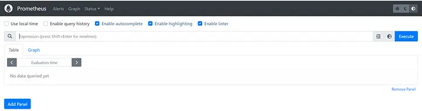

# Monitoring Project : monitoring EKS Cluster
EKS monitoring using Helm, Prometheus and Grafana Dashboard for pull and collects metrics from targets by scraping metrics HTTP endpoints.Monitoring is needed to Understand the state of your infrastructure and systems is essential for ensuring the reliability and stability of services.

### Monitoring Project Diagram:


## Tools Used:

* AWS Account
* AWS CLI, kubectl, eksctl & Helm
* Jenkins
* Docker & Dockerhub
* Github
* Prometheus & Grafana
* eks cluster

## Steps to complete project: 

1. setup IAM user and Configure AWS Credentials
2. Setup EC2 instance with IAM Role with administration access
3. Install and setup AWS CLI, kubectl, eksctl, Helm Charts
4. Creating an Amazon EKS cluster
5. Add Prometheus Helm repo
6. Install Prometheus with Prometheus namespace
7. Install Node JS application and monitor it on Grafana
8. Cleanup/Deprovision


### Step 1: IAM Configuration
- create IAM user `user` with administration access.
- Generate Security Credentials: Access Key and Secret Access Key.

### Step 2: EC2 Setup
- Launch a t2.medium Ubuntu instance in a favourite region (eg. region `us-east-1`).
-  sg expose port 80,22, 443,9090, 8080 & 3000 
- SSH into the instance from your local machine.

### Step 3: clone repo
```shell
git clone https://github.com/nusratdevo/eks-monitoring
```

### Step 4: install tools
- make file executable and Run the file
``` shell 
chmod +x tools-install.sh
./tools-install.sh
```
### Step 5: check every tools install successfully
``` shell
jenkins --version
docker --version
aws --version
kubectl version --short --client
eksctl version
helm version
```


### Step: Install EKS cluster using eksctl
```shell 
eksctl create cluster --name eks2 --region us-east-1 --nodegroup-name eks4-nodes --node-type t3.small --managed --nodes 2 --nodes-min 2 --nodes-max 3 
```
*  Cluster Name:  eks4, nodegroup-name:- eks4-nodes
* Region:         region us-east-1
-  it would take 15–20 minutes for this installation to complete.


### Step: verify the cluster creation


- We can verify the cluster by logging into the AWS EKS Console dashboard itself
- We also verify EKS cluster is up and running in commandline by the following command

``` eksctl get cluster --name eks2 --region us-east-1 ```

- configure aws in local mechine and then enter AWS Access key ID and AWS secret access key run bellow command
``` aws configure ```

- Update the config of created EKS Cluster on local PC.It will Generate an Kubernetes configuration file
``` aws eks update-kubeconfig --name eks2 --region us-east-1 ```

- To view the list of worker nodes as part of EKS cluster.
``` shell
Kubectl get nodes
kubectl get pods
```

### Step 6: Install Prometheus using Helm Stable Charts
```shell
helm repo add stable https://charts.helm.sh/stable
```
-  Add Prometheus Helm repo
```shell
helm repo add prometheus-community https://prometheus-community.github.io/helm-charts
helm repo update
```
- Create Prometheus namespace
```shell
kubectl create namespace prometheus
```
-  Install Prometheus
```shell
helm install stable prometheus-community/kube-prometheus-stack -n prometheus
```
- To check whether Prometheus is installed or not use the below command
``` kubectl get pods -n prometheus ```


- check the services file (svc) of the Prometheus
 ``` kubectl get svc -n prometheus```


Grafana will be coming along with Prometheus as the stable version

### Steps: Exposing Prometheus and Grafan to the external world
- We change service type in svc file from ClusterIP to LoadBalancer
``` kubectl edit svc stable-kube-prometheus-sta-prometheus -n prometheus ```
- verifiying attached LoadBalancer to svc file
``` kubectl get svc -n prometheus ```


- enter load balancer url to browser and  I can access Prometheus on port 9090


### step: access  Grafana 
```shell
kubectl edit svc stable-grafana -n prometheus
```
-attached Grafana LoadBalancer to Grafana svc file also exposed it
``` kubectl get svc -n prometheus ```
- access Grafana LoadBalancer in the browser

 

- create grafana password
```shell
export PROM_PWD=`kubectl get secret --namespace prometheus stable-grafana -o jsonpath="{.data.admin-password}" | base64 --decode` ; echo
```
```shell
username: admin
echo PROM_PWD
```
### Step: Create a Dashboard in Grafana
* On left navigation click on the Toggle menu and then click on Dashboard.
* And then click on the New button -> click on import
* click on Import and import the dashboard with numbers
* Copy id and load it : 17119
* uses a Prometheus dashboard number: 15760
* And select the data source Prometheus and import it.


---


---

---

* Entire data of the cluster: where we can able to see the entire data of the EKS cluster
     - CPU and RAM use
     - pods in a specific namespace
     - Pod up history
     - HPA
     - Resources by Container


### Steps: Install Node JS application and monitor it on Grafana
- To make use of Grafana dashboard, we will deploy Node.js application on Kubernetes.
- We will run the following kubectl command.
```shell
kubectl apply -f deployment.yml
kubectl get deployment
kubectl get pods
kubectl get svc
```
- enter svc loadbalancer on browser
- Refresh the Grafana dashboard to verify the deployment

### Step: Clean up/Deprovision
```shell
eksctl delete cluster --name eks2
```
- We do EKS Monitoring using Prometheus and Grafana with the help of AWS CLI, kubectl, eksctl and helm utility.


